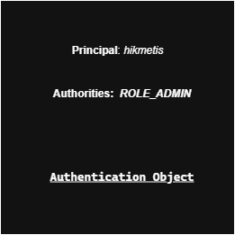
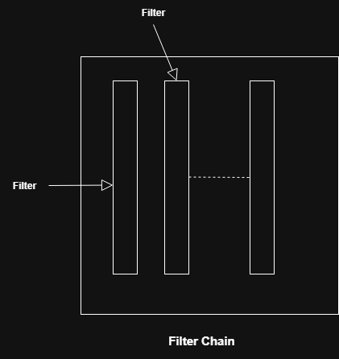
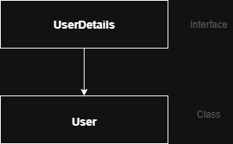
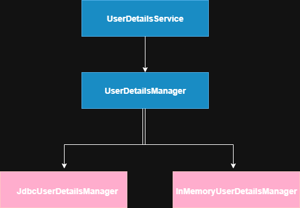
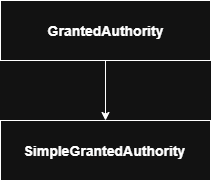

----

## Notes

<p align="center">
      
</p>

> **Principal** represents the currently logged-in user. User details(username, email etc.) become your **principal.**

> **Authentication Object** is a more comprehensive representation of the user's auth information.

<p align="center">
      
</p>

> **Filters** are components that can intercept and modify incoming requests amd outgoing responses in a web app.

> A **Filter Chain** is a sequence of filters that an HTTP req and res pass through before reaching the targeted resource and after the resource has generated res.

> #### How Filters and Filter Chains work?
> - The first filter in the chain receives that req and perfoms its processing.
> - After processing, the filter calls **chain.doFilter(req, res)** to pass the req to the next filter in the chain.
> - This process continues until the req reaches the final resource.
> - The res generated by the resource then travels back through the chain, allowing each filter to perform any necessary post-processing.

> #### Why Filters?
> - Cross-Cutting Concerns
> - Pre-Processing and Post-Processing
> - Req and Res Manipulation
> - Separation of Concerns

##

> **Auth Providers** in spring security are components handle the actual verification of credentials provided by a user during the login process.
> - DaoAuthenticationProvider
> - InMemoryAuthenticationProvider
> - LdapAuthenticationProvider
> - ActiveDirectoryLdapAuthenticationProvider
> - PreAuthenticatedAuthenticationProvider
> - OAuth2AuthenticationProvider

> **In-Memory Auth** is storing and managing user credentials directly within the app's memory

##

<div style="display: flex; justify-content: center; gap: 20px;">
    
    
</div>

> ### User Details
> The **UserDetails** interface in Spring Security represents a user's core information within the application. It defines methods to retrieve essential details such as the _username, password, authorities (roles or permissions), and account status (e.g., enabled, expired, or locked)_.
> ### User
> The **User** class is a concrete implementation of the **UserDetails** interface provided by Spring Security. It offers a convenient way to create a **UserDetails** object with a predefined _username, password, and authorities_, typically used for simple in-memory authentication or testing purposes.
> ### UserDetailsService
> The **UserDetailsService** interface is responsible for loading user-specific data in Spring Security. It defines a single method, `loadUserByUsername(String username)`, which retrieves a user by their username and returns a **UserDetails** object, typically from a data source like a database or in-memory store.
> ### UserDetailsManager
> The **UserDetailsManager** interface extends **UserDetailsService** and adds methods for managing user accounts in Spring Security. It provides functionality to create, update, and delete users, as well as change passwords and check for user existence, making it suitable for applications requiring user management capabilities.
> ### JdbcUserDetailsManager
> The **JdbcUserDetailsManager** is a concrete implementation of the **UserDetailsManager** interface in Spring Security. It extends **JdbcDaoSupport** and provides user management functionality by interacting with a relational database using JDBC. It handles operations such as creating, updating, deleting users, changing passwords, and checking user existence, while also supporting the retrieval of user details as defined by the **UserDetailsService** interface.

```
@Bean
public UserDetailsService userDetailsService(DataSource dataSource) {
    JdbcUserDetailsManager manager = new JdbcUserDetailsManager();
    manager.setDataSource(dataSource);
    // Optional: Customize SQL queries if using a non-default schema
    manager.setUsersByUsernameQuery("SELECT username, password, enabled 
        FROM my_users WHERE username = ?");
    manager.setAuthoritiesByUsernameQuery("SELECT username, role 
        FROM my_authorities WHERE username = ?");
    return manager;
}

@Bean
public PasswordEncoder passwordEncoder() {
    return new BCryptPasswordEncoder();
}
```

> ### InMemoryUserDetailsManager
> The **InMemoryUserDetailsManager** is a class in Spring Security that provides a simple, in-memory implementation of the **UserDetailsManager** interface. It is used for managing *user details (like usernames, passwords, and authorities/roles)* during authentication, primarily for testing or small-scale applications where a database or external user store is not required.

```
@Configuration
public class SecurityConfig {

    @Bean
    public UserDetailsService userDetailsService() {
        InMemoryUserDetailsManager manager = new InMemoryUserDetailsManager();
        
        manager.createUser(
            User.withUsername("user")
                .password("{noop}password") // {noop} indicates no password encoding
                .roles("USER")
                .build()
        );
        
        manager.createUser(
            User.withUsername("admin")
                .password("{noop}admin123")
                .roles("ADMIN")
                .build()
        );
        
        return manager;
    }
}
```

> ### Role Based Auth
> **Role-based auth** is a method of restricting access to resources based on the roles assigned to users.

<p align="center">
      
</p>